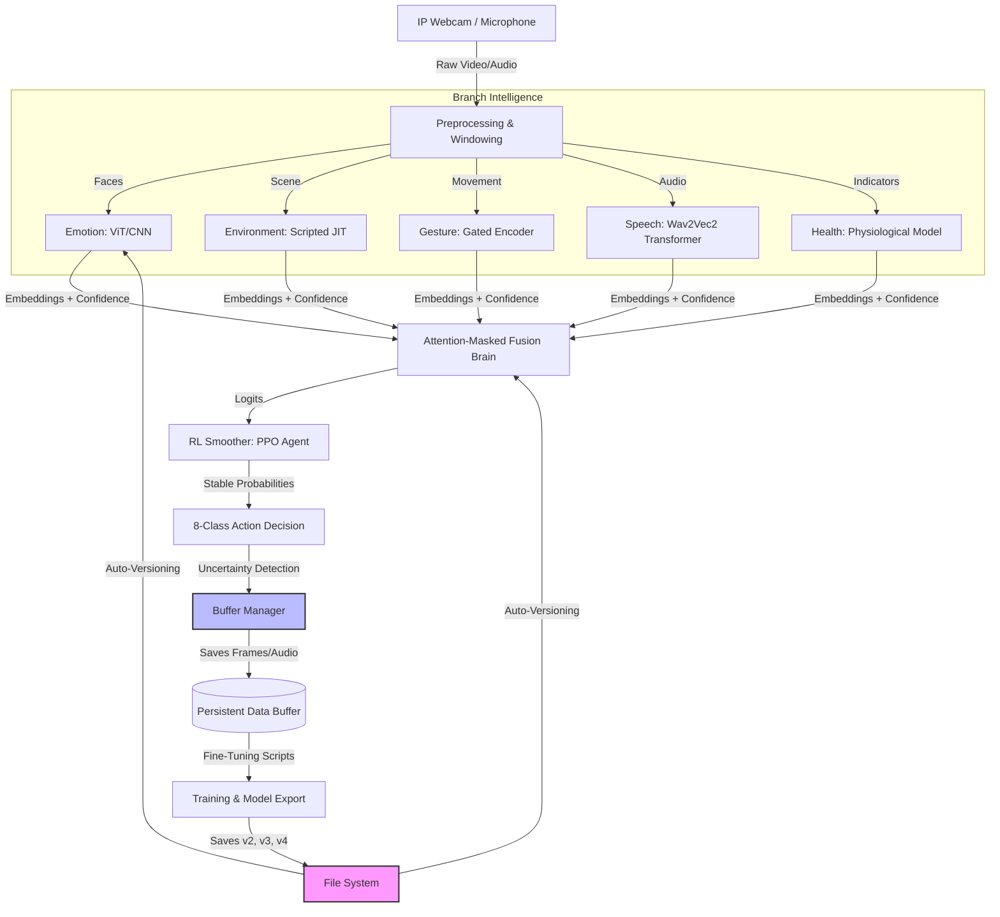

# 🧠 Multimodal Patient Monitoring & Iterative Learning System (MPMIS)

   

## 📑 Project Essence
MPMIS is an industrial-grade multimodal platform that integrates **5 sensory modalities** (Vision, Sound, and Context) to monitor patient safety. The system is designed with a **self-evolving iterative loop**: it detects its own uncertainty, saves those "edge cases," and uses them for autonomous retraining.

---

## 🏗 Industrial Architecture & Data Flow
The system follows a strict pipeline to ensure high-stakes decisions (like `Call Nurse`) are grounded in multi-sensor evidence.



---

## 🛠 Prerequisites & Installation

### 1. Model Dependencies
This project utilizes **Wav2Vec2** for speech processing. On the first run, the system will automatically download `facebook/wav2vec2-base` from HuggingFace.

### 2. Environment Setup
```bash
# Core Neural Engines
pip install torch torchvision torchaudio --index-url https://download.pytorch.org/whl/cu118

# Vision & Audio Processing
pip install opencv-python numpy pillow sounddevice librosa transformers timm requests
```

### 3. Hardware Requirements
- **Camera**: Local USB Webcam (Index 0) or **IP Webcam** (Mobile).
- **GPU**: NVIDIA GPU (CUDA) strongly recommended for real-time performance.

---

## 🚀 Execution & Configuration

### Running the Real-Time Suite
```bash
python3 realtime_fusion_8cls.py
```

### Key Configuration (`realtime_fusion_8cls.py`):
- **Modality Gating**: Gestures are automatically masked if confidence is below **75%** to prevent halluncinations.
- **Audio Windowing**: A **1.0s sliding buffer** ensures no words are cut off during hardware chunking.
- **Auto-Versioning**: The system uses `get_latest_model()`. If you train a new model and name it `emotion_model_full_v2.pth`, the system will **automatically load it** on the next start.

---

## 📂 Project Module Catalog

The repository is organized into distinct functional layers:

| Category | Key Files | Purpose |
| :--- | :--- | :--- |
| **Main Engine** | `realtime_fusion_8cls.py` | Orchestrates all 5 branches, fusion, and display. |
| **Data Management** | `buffer_manager.py` | Captures edge cases and organizes them into `/buffers`. |
| **Decision Smoothing** | `ppo_inference.py`, `rl_environment.py` | Stabilizes predictions using Reinforcement Learning. |
| **Model Research** | `Emotion.ipynb`, `Speech.ipynb`, `Gesture.ipynb` | Core training logs, dataset analysis, and JIT exports. |
| **Auto-Training** | `train_fusion_v3.py`, `train_emotion_finetune.py` | Scripts to retrain models on the saved buffers. |
| **Production Weights**| `best_fusion_model_8cls.pt` | High-performance TorchScript fusion weights. |

---

## 🔄 The Iterative Learning Workflow (How to Evolve the System)

1.  **Monitor**: Run the system. If it misclassifies a gesture, the `BufferManager` saves it to `/buffers/gesture/`.
2.  **Label**: Review the saved data in `/buffers`.
3.  **Train**: Run `python3 train_gesture_finetune.py`.
4.  **Deploy**: The script will save `gesture_model_v2.pth`.
5.  **Restart**: Simply restart `realtime_fusion_8cls.py`; it will detect `v2` and start using the improved intelligence immediately.

---

## ⚠️ Troubleshooting & FAQ
- **"IP Webcam connection error"**: Check if your phone and PC are on the same Wi-Fi. Set `USE_IP_WEBCAM_AUDIO = False` to use your computer's built-in mic instead.
- **"Speech masked"**: Ensure `transformers` is installed. The first run requires internet access to download the Wav2Vec2 backbone.
- **"Gesture [MASKED]"**: This is intentional. It means the system sees motion but isn't 75% sure it's a specific command.

---
**Technical Lead**: Antigravity AI  
**Project Status**: Production Ready / Iterative Mode Active
