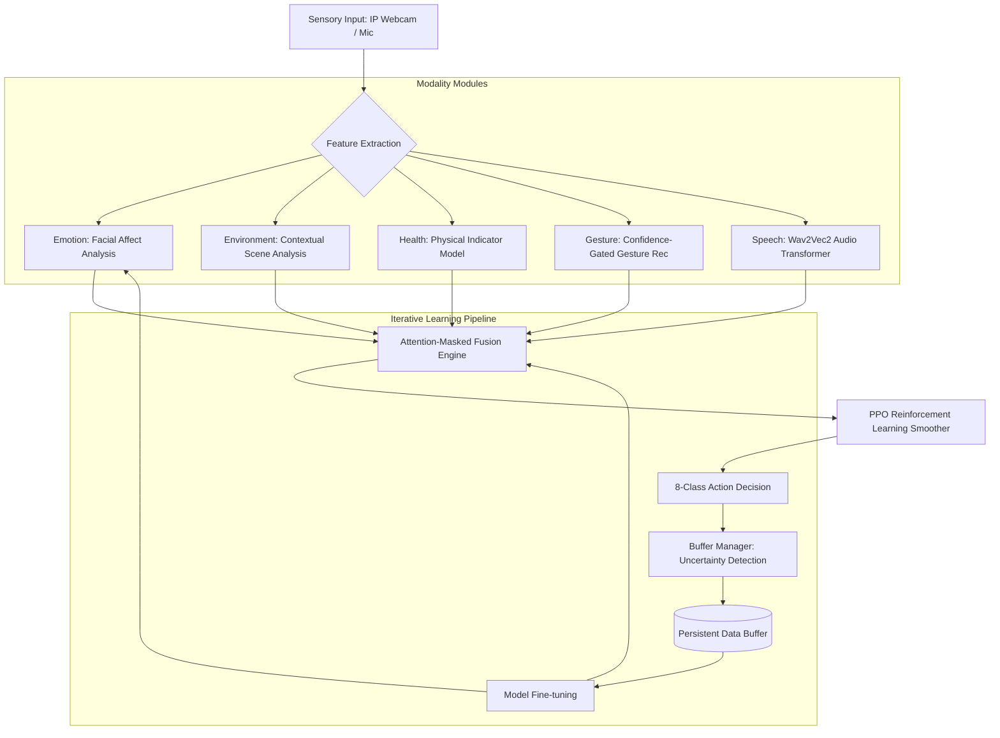

# 🧠 Multimodal Patient Monitoring & Iterative Learning System (MPMIS)

  

## 📋 Executive Summary
The **Multimodal Patient Monitoring & Iterative Learning System (MPMIS)** is a state-of-the-art AI framework designed for high-fidelity patient surveillance. By integrating five distinct sensory modalities—**Emotion, Environment, Health, Gesture, and Speech**—the system provides a comprehensive "Action Prediction" that outperforms traditional single-modality sensors. 

It features an autonomous **Iterative Learning Loop** that self-corrects by capturing edge-case data, and a **Reinforcement Learning (RL) Smoother** to ensure temporal stability in decision-making.

---

## 🏗 System Architecture
The MPMIS architecture is built on a modular "Branch & Fusion" design. Each modality operates as an independent feature extractor, whose outputs are concatenated and processed by a weighted Attention-Masked Fusion Brain.



---

## 🚀 Getting Started

### 1. Prerequisites & Dependencies
The system requires a CUDA-enabled GPU for real-time inference (though CPU fallback is supported).

**Primary Libraries:**
- **Core ML**: `torch`, `torchvision`, `torchaudio`
- **Vision**: `opencv-python`, `pillow`, `timm`
- **Audio**: `librosa`, `sounddevice`, `transformers`
- **Utilities**: `numpy`, `requests`, `pyyaml`

**Installation:**
```bash
pip install torch torchvision torchaudio --index-url https://download.pytorch.org/whl/cu118
pip install opencv-python numpy pillow sounddevice librosa transformers timm requests
```

### 2. Hardware Setup (IP Webcam)
The system is designed to interface with mobile devices via the **IP Webcam** protocol for remote sensing.
1.  Launch **IP Webcam** on an Android/iOS device and start the server.
2.  In `realtime_fusion_8cls.py`, configure the endpoint:
    ```python
    IP_WEBCAM_IP = "192.168.x.x"  # Device IP
    IP_WEBCAM_PORT = 8080         # Default Port
    ```

### 3. Execution
Run the primary real-time monitoring interface:
```bash
python3 realtime_fusion_8cls.py
```

---

## 🛠 Module Deep Dive

### 🔹 Visual Intelligence (Emotion & Gesture)
- **Facial Affect**: Utilizes a Vision Transformer (ViT) to detect 8 primary emotions, providing indicators of pain or distress.
- **Hand Gestures**: Employs a confidence-gated CNN. The system ignores signals below 75% confidence to eliminate environmental noise.

### 🔹 Auditory Intelligence (Speech)
- **Transformer Audio**: Powered by **Wav2Vec2**, the speech module analyzes audio buffers for critical keywords and distress calls. It uses a 1.0s sliding window for high temporal resolution.

### 🔹 Decision Intelligence (RL Smoother)
- **Temporal Stability**: A **Proximal Policy Optimization (PPO)** agent acts as a "low-pass filter" on model predictions, preventing rapid jumping between action classes and ensuring high-confidence triggers.

### 🔹 Data Intelligence (Buffer Manager)
- **Iterative Pipeline**: Automatically captures frames when the Fusion Engine is uncertain. These "edge cases" are saved in `/buffers/` for future retraining, enabling the system to learn from its own mistakes autonomously.

---

## 📁 Repository Structure

| File | Description |
| :--- | :--- |
| `realtime_fusion_8cls.py` | The main execution script for real-time monitoring. |
| `buffer_manager.py` | Core logic for the autonomous data collection system. |
| `ppo_inference.py` | Reinforcement Learning agent for prediction smoothing. |
| `Emotion.ipynb` | Research notebook for vision branch development. |
| `best_fusion_model_8cls.pt` | Compiled TorchScript weights for production use. |
| `CONTINUAL_LEARNING_PLAN.md` | Roadmap for long-term model evolution. |

---

## ⚠️ Troubleshooting
- **Webcam Latency**: Ensure the mobile device and host PC are on the same 5GHz Wi-Fi band.
- **Audio Stream Error**: Verify that the IP Webcam's audio stream is enabled in the app's settings.
- **Masked Modalities**: If a modality shows `[MASKED]`, check lighting conditions or audio input levels.

---
Developed for advanced clinical support systems. **Confidentiality and Privacy: Use only with approved patient consent.**
