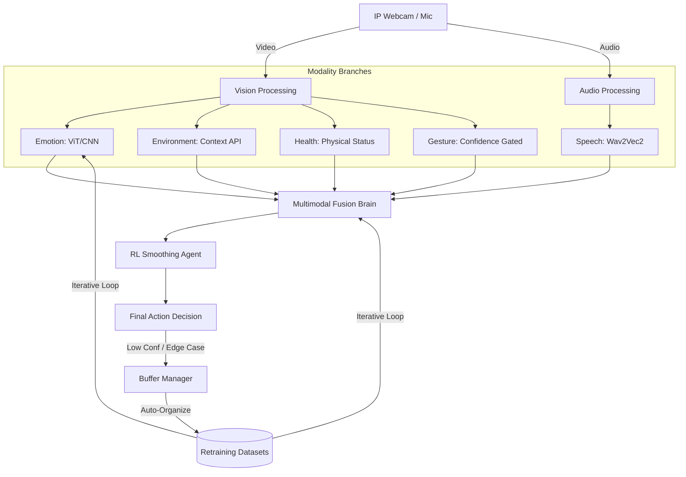

# 🧠 Multimodal Patient Monitoring & Iterative Learning System

[](https://www.python.org/downloads/)
[](https://pytorch.org/)
[](https://opensource.org/licenses/MIT)

An advanced, real-time multimodal AI platform designed for high-stakes patient care environments. This system fuses visual, environmental, and auditory signals to categorize patient status into 8 critical action classes, utilizing **Reinforcement Learning (RL)** for decision stability and an **Autonomous Iterative Learning** pipeline for continuous model evolution.

---

## 📑 Table of Contents
- [Project Overview](#-project-overview)
- [System Architecture](#-system-architecture)
- [The 5-Modality Fusion Brain](#-the-5-modality-fusion-brain)
- [Installation & Setup](#-installation--setup)
- [Hardware Configuration (IP Webcam)](#-hardware-configuration-ip-webcam)
- [Running the System](#-running-the-system)
- [Autonomous Iterative Learning](#-autonomous-iterative-learning)
- [Reinforcement Learning Smoother](#-reinforcement-learning-smoother)
- [File Structure Guide](#-file-structure-guide)

---

## 🌟 Project Overview

Traditional monitoring systems rely on single-source data (e.g., just video). This project implements a **Multimodal Transformer-based Fusion** architecture that understands context. It doesn't just see a patient; it understands if they are in an office vs. a hospital bed, listens for "Help" commands, and gates low-confidence gestures to prevent false alarms.

### Key Capabilities:
- **Real-time 8-Class Classification**: Categorizes status from `Normal` to `Emergency`.
- **Intelligent Modality Gating**: Automatically masks modalities during sensor failure or low confidence (e.g., ignoring gesture noise when no hand is present).
- **RL Decision Smoothing**: Uses a PPO-trained agent to eliminate prediction "flickering" between frames.
- **Autonomous Retraining**: Automatically captures and organizes "edge-case" data to improve models over time.

---

## 🏗 System Architecture



---

## 🧠 The 5-Modality Fusion Brain

The system processes five distinct data streams to reach a consensus:

| Modality | Technology | Role |
| :--- | :--- | :--- |
| **Emotion** | ViT / ResNet (Timm) | Detects facial distress, pain, or agitation. |
| **Environment** | Scripted Context | Identifies setting (e.g., Hospital, Laboratory, Office). |
| **Health** | Physiological Model | Tracks basic physical state indicators. |
| **Gesture** | CNN-based Gated | Interprets hand signals (Help, Stop) with a 75% confidence gate. |
| **Speech** | Wav2Vec2 (Transformer) | High-fidelity recognition of spoken distress calls. |

---

## ⚙️ Installation & Setup

### 1. Clone the Repository
```bash
git clone https://github.com/2023priyanshubhargav-cpu/dl-project.git
cd emotion_project
```

### 2. Install Dependencies
Ensure you have Python 3.8+ installed. It is recommended to use a virtual environment.
```bash
pip install torch torchvision torchaudio --index-url https://download.pytorch.org/whl/cu118
pip install opencv-python numpy pillow sounddevice librosa transformers timm requests
```

### 3. RL Smoother Setup (Optional but Recommended)
To enable stable predictions without flickering:
```bash
python3 setup_rl.py
python3 install_rl_dependencies.py
```

---

## 📱 Hardware Configuration (IP Webcam)

This project is optimized for use with the **IP Webcam** app (Android/iOS), allowing your mobile phone to act as the primary sensor.

1.  Open **IP Webcam** on your phone.
2.  Start the Server and note the IP address (e.g., `192.168.1.5:8080`).
3.  Update the configuration in `realtime_fusion_8cls.py`:
    ```python
    USE_IP_WEBCAM_AUDIO = True
    IP_WEBCAM_IP   = "192.168.1.5" # Your Phone's IP
    IP_WEBCAM_PORT = 8080
    ```

---

## 🚀 Running the System

To launch the full 8-class multimodal monitoring interface:

```bash
python3 realtime_fusion_8cls.py
```

### Controls:
- **'Q'**: Safe shutdown (stops audio streams and saves buffers).
- **Terminal Output**: Displays real-time confidence scores and **`[MASKED]`** tags for ignored sensors.

---

## 🔄 Autonomous Iterative Learning

The `BufferManager` acts as the system's long-term memory. It monitors the uncertainty of the fusion model. If the system is unsure about a specific frame, it:
1.  **Captures** the frame and the audio snippet.
2.  **Labels** it with the current model prediction.
3.  **Saves** it to the `/buffers` directory, organized by modality.

This data is then used by the `train_fusion_v3.py` scripts to "harden" the model against its own weaknesses.

---

## 🤖 Reinforcement Learning Smoother

To prevent "Action Flickering" (where the system jumps between `Normal` and `Emergency` rapidly), we utilize a **PPO (Proximal Policy Optimization)** agent.
- **Input**: Current probabilities from the Fusion Brain.
- **Goal**: Maintain temporal consistency.
- **Output**: A smoothed, stable action that waits for consistent evidence before triggering an alarm.

---

## 📂 File Structure Guide

*   `realtime_fusion_8cls.py`: **Main Entry Point**.
*   `buffer_manager.py`: Logic for autonomous data collection.
*   `ppo_inference.py`: Interface for the RL smoothing agent.
*   `Emotion.ipynb`: The primary research and training notebook.
*   `Speech.ipynb`: Wav2Vec2 fine-tuning and audio processing.
*   `best_fusion_model_8cls.pt`: Production-ready TorchScript weights.
*   `/buffers`: Auto-generated datasets for iterative learning.

---

Developed by **Antigravity** & the **Advanced Agentic Coding Team**.
