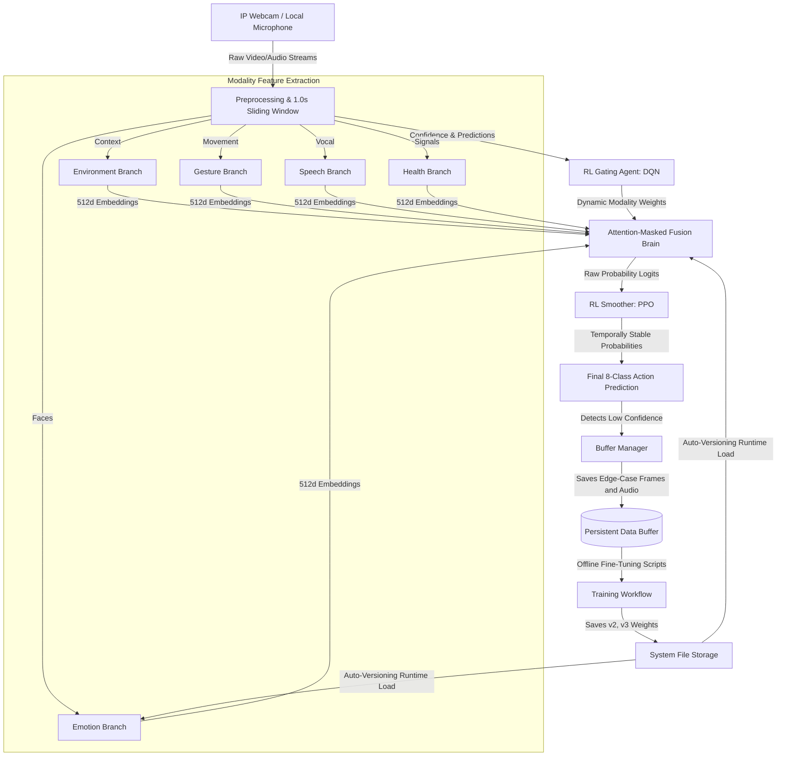

# 🧠 Continual Deep learning for Adaptive perception and Decision making for Human-Robot Interaction

   

## 📑 Project Essence
The **Continual Deep learning for Adaptive perception and Decision making for Human-Robot Interaction** project is an industrial-grade platform that integrates five distinct sensory modalities to continuously monitor patient status. By employing a late-fusion multimodal architecture, the system is highly robust against single-sensor failures. 

Furthermore, the system is designed with a **Self-Evolving Iterative Loop**: it detects inference uncertainty in real-time, autonomously saves the surrounding "edge-case" sensory data, and seamlessly integrates these cases into future model fine-tuning iterations.

---

## 🔬 Core Modalities & Architectures
Each sensory branch extracts highly specialized features before reaching the fusion brain. The exact neural architectures are defined as follows:

- **Emotion**: `convnext_small` (via `timm`) augmented with a custom **CBAM** (Convolutional Block Attention Module) for deep facial affect and micro-expression detection.
- **Environment**: `resnet50` (pretrained vision backbone) for processing the contextual layout of the scene (e.g., distinguishing a hospital bed from an office environment).
- **Health**: `Custom 1D CNN` (`ConvBlock1D` arrays with kernel=7) designed to process multi-channel physiological or physical indicator signals over time.
- **Gesture**: `efficientnet_b0` (via `torchvision.models`) functioning as a Confidence-Gated Gesture Encoder to reliably track hand signals like "Help" or "Stop" while masking false positives.
- **Speech**: `facebook/wav2vec2-base` (via HuggingFace Transformers) processing audio on a 1.0s sliding window to capture real-time spoken distress commands.

---

## 🏗 Industrial Architecture & Data Flow



---

## 🤖 Double-Layer Reinforcement Learning

The platform employs a unique **Double-RL Architecture** to maximize trust and stability in high-stakes clinical environments:

### Layer 1: Dynamic Modality Gating (Intake)
Powered by a **DQN-based Gating Agent**, this layer acts as an "intelligent filter" before fusion occurs. It analyzes the real-time confidence scores of all 5 sensors and dynamically assigns trust weights. 
*   **Feature**: If a modality (e.g., Gesture) is detected as noisy or low-confidence, the DQN agent masks it out (`weight=0.0`) or down-weights it, preventing garbage data from skewing the final diagnosis.
*   **Logic**: Trained using a complex MDP (Markov Decision Process) with 10 distinct gating strategies.

### Layer 2: Temporal Prediction Smoothing (Output)
Powered by a **PPO-based Smoother**, this layer analyzes the history of classification logits to prevent "output flickering."
*   **Feature**: Ensures the transition between patient states (e.g., from `Normal` to `Distressed`) is smooth and robust to momentary sensor glitches.

---

## 📊 Research & Benchmarking (7-Algorithm Study)

To ensure peak performance, the system includes a comprehensive RL benchmark suite (`rl_v2_train.py`) that compares **7 different reinforcement learning algorithms**:

| Algorithm Type | Models Tested |
| :--- | :--- |
| **On-Policy** | PPO, A2C, REINFORCE |
| **Off-Policy** | DQN, Q-Learning, SARSA |
| **Asynchronous** | A3C (Simulated) |

### Key Research Artifacts:
The system automatically generates a research-grade visualization suite in `/rl_v2_results/`, including:
- **Ablation Studies**: Comparing RL Gating vs. Static Gating baselines.
- **Convergence Curves**: Reward and Loss history across 50,000+ training steps.
- **Policy Heatmaps**: Visualizing the decision-making logic of each algorithm across clinical scenarios.
- **Parameter Sensitivity Analysis**: Head-to-head stability comparison (Learning Rate sweeps) between PPO and DQN.

---

## ⚙️ Complete Setup & Execution Flow

Follow this exact workflow to deploy the framework on your local machine or server.

### Step 1: Clone the Repository
```bash
git clone https://github.com/2023priyanshubhargav-cpu/dl-project.git
cd dl-project
```

### Step 2: Environment Setup
It is highly recommended to isolate the project within a virtual environment.
```bash
# Create and activate virtual environment
python3 -m venv venv
source venv/bin/activate 

# Install core engines
pip install torch torchvision torchaudio --index-url https://download.pytorch.org/whl/cu118
pip install stable-baselines3[extra] gymnasium shimmy

# Install utilities
pip install opencv-python numpy pillow sounddevice librosa transformers timm matplotlib seaborn
```

### Step 3: Hardware Sensor Configuration (IP Webcam)
The system natively supports the **IP Webcam** app (Android/iOS) to utilize your mobile phone as an untethered biometric sensor.
1. Download and launch **IP Webcam** on your mobile device.
2. Press "Start server" at the bottom of the app.
3. Note the IP address displayed on your phone screen (e.g., `192.168.1.5:8080`).
4. Open `realtime_fusion_8cls.py` and configure the endpoint on line ~88:
    ```python
    USE_IP_WEBCAM_AUDIO = True
    IP_WEBCAM_IP        = "192.168.1.5" # Update this to match your phone
    IP_WEBCAM_PORT      = 8080
    ```

### Step 4: Run the Real-Time Inference Engine
Initialize the 5-branch multimodal fusion interface:
```bash
python3 realtime_fusion_8cls.py
```
**Runtime Controls:**
- Press **'Q'** to safely shut down the system. This gracefully terminates audio threads and writes any pending buffer data to disk.

---

## 🔄 The Full Iterative Learning Process

The true strength of MPMIS is its ability to autonomously collect training data when it fails, allowing developers to create rapidly evolving model versions.

### Phase 1: Autonomous Edge-Case Collection
While `realtime_fusion_8cls.py` is running, the **Buffer Manager** analyzes the confidence score of the Fusion Brain. If the prediction is uncertain (e.g., < 75% confidence on an "Emergency" action), the system captures the raw video frame and the 1.0s audio chunk and saves it locally in the `/buffers/[modality]/` directories.

### Phase 2: Supervised Label Verification
Developers can periodically check the `/buffers/` directory to review the edge cases that confused the system. Mislabelled data can be manually moved or corrected.

### Phase 3: Fine-Tuning Execution
Run the dedicated training scripts to fine-tune specific modalities or the overarching fusion brain on the newly collected edge cases:
```bash
python3 train_emotion_finetune.py
# or
python3 train_fusion_v3.py
```

### Phase 4: Auto-Versioning Deployment
The fine-tuning scripts are programmed to save weights sequentially (e.g., `emotion_model_full_v2.pth`, `best_fusion_model_8cls_v3.pt`).
The primary `realtime_fusion_8cls.py` script utilizes a `get_latest_model()` dynamic loader. Upon your next execution, the system will **automatically detect and load** the highest-versioned weights, closing the iterative loop with zero manual code changes.

---

## 📂 Comprehensive Module Catalog

| Module | Filename | Function |
| :--- | :--- | :--- |
| **Main Loop** | `realtime_fusion_8cls.py` | Orchestrates the 5-branch fusion, RL Gating, and RL Smoothing layers in real-time. |
| **RL Gating Inference** | `rl_v2_inference.py` | Wrapper for loading trained DQN/PPO gating agents for live inference. |
| **RL Training Suite**| `rl_v2_train.py` | The research engine. Benchmarks 7 algorithms and generates all analysis graphs. |
| **RL Environment** | `rl_v2_environment.py` | Defines the Gymnasium MDP for modality trust and gating rewards. |
| **Decision Smoothing**| `ppo_inference.py` | Layer 2 RL agent for temporal output stabilization. |
| **Data Orchestration**| `buffer_manager.py` | Manages the JIT edge-case collection for the Continual Learning loop. |
| **Training Pipeline** | `train_fusion_v3.py` | Automated fine-tuning loops for the late-fusion transformer brain. |
| **Jupyter Research** | `Emotion.ipynb` etc. | Foundational DL research and backbone architecture definitions. |
